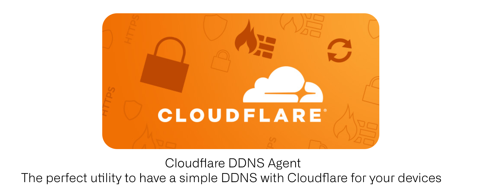

<p align="center">
  </img>
</p>

<p align="center">
    <a href="https://github.com/zerjioang/ddns-cloudflare/releases"/>
    <a href="https://goreportcard.com/badge/github.com/zerjioang/ddns-cloudflare"/>
    <a href="https://github.com/zerjioang/ddns-cloudflare/blob/master/LICENSE">
    	
    </a>
    <a href="https://travis-ci.org/zerjioang/ddns-cloudflare">
      
    </a>
	<a href="https://pkg.go.dev/github.com/zerjioang/ddns-cloudflare">
    	
    </a>
</p>

## Introduction

DDNS is an agent that continuously monitors changes in the public Internet IP address of a connection for a host and updates Cloudflare's DNS when a change is detected.

An example setup illustrated below has a Raspberry Pi running a webserver with DDNS on a home Internet connection. The website's domain name (let's use example.com) resolves to Cloudflare's DNS servers. When a web client access example.com, the HTTP/S connection terminates on Cloudflare's infrastructure. Cloudflare then proxies the connection to the home Internet connection where the home router port forwards to the Raspberry Pi. At any time if the home Internet connection IP address changes, DDNS sends an update informing Cloudflare of the new home IP address for it to proxy to.


## Goal

It updates your device (raspberru pi, beaglebone, linux, container, vm, etc) IP address on a Dynamic
DNS provider like Cloudflare so that you can forget about device IP and use it a DNS name.

## Requirements

* A Cloudflare account.
* A owned domain name registered in Cloudflare.
* A Token created using Cloudflare dashboard to allow this application to edit your DNS Zone info.

## Usage

```bash
X_CF_AGENT_TOKEN=yourtoken \
X_CF_AGENT_ZONE=example.com \
X_CF_AGENT_DNS_A_RECORD=rpi \
cfagent update
```

Previous command will try to update the DNS A Record of `rpi.example.com` with the host actual public IP

### Customization of DDNS Cloudflare Agent

* **X_CF_AGENT_TOKEN**: token provided by Cloudflare in order to authenticate API calls
* **X_CF_AGENT_ZONE**: name of the DNS zone you want to edit
* **X_CF_AGENT_DNS_A_RECORD**: name of the DNS Record name you want to edit.

## Configure autostart

### Using systemd autostart

Edit the cfagent.service file and move it to `/etc/systemd/system/`, then run:

```bash
sudo systemctl daemon-reload
sudo systemctl enable cfagent
sudo systemctl start cfagent
```
## Troubleshooting

### API Token must not be empty

```bash
2021/10/20 20:27:09 Updating device IP. Please wait...
2021/10/20 20:27:09 Requesting IP check for:  .
2021/10/20 20:27:09 Reading current device IP. Please wait...
2021/10/20 20:27:09 Readed IP:  X.Y.Z.A
2021/10/20 20:27:09 Connecting with Cloudflare services...
2021/10/20 20:27:09 cloudflare ddns updater took 101.71621ms
invalid credentials: API Token must not be empty
```

Make sure you have successfully set the `X_CF_AGENT_TOKEN` environment variable with a valid Cloudflare token.

### 

```bash
2021/10/20 20:28:56 Updating device IP. Please wait...
2021/10/20 20:28:56 Requesting IP check for:  example.com.rpi
2021/10/20 20:28:56 Reading current device IP. Please wait...
2021/10/20 20:28:57 Readed IP:  X.Y.Z.A
2021/10/20 20:28:57 Connecting with Cloudflare services...
2021/10/20 20:28:58 cloudflare ddns updater took 1.070368081s

ListZonesContext command failed: HTTP status 400: Invalid request headers (6003)
```
Make sure you have successfully set the `X_CF_AGENT_TOKEN` and the token has the ability to manage your DNS Zone data.
If you set the wrong scope of the token, you have to create a new one.

## License

MIT
